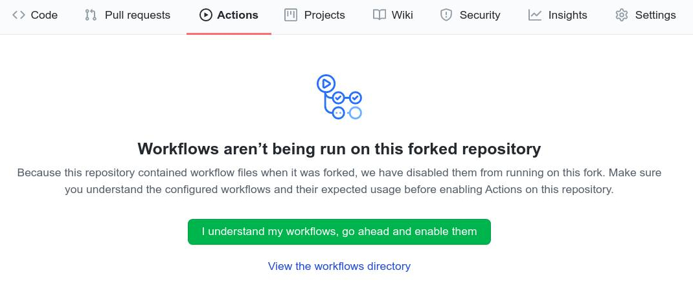

# Windows-ISO-Extractor
Extract Important files from MS Windows ISO files

# Usage Scenario
- If you have a corrupted system file or dll in windows and reinstalled the whole system because you can not get the original file.
- Some Windows boot files in **`EFI`** partition got corrupted and you are stuck.
- You are a Linux user and wanted windows' fonts to avoid compatibility issues in Microsoft Office files.

You can now download any file you need from windows file system.

# Downloads
Download Windows Boot and Font files for different windows 10 versions from [releases](https://github.com/3omar-mostafa/Windows-ISO-Extractor/releases)

### Currently Have
- [Windows 10 20H2 English International x64](https://github.com/3omar-mostafa/Windows-ISO-Extractor/releases/tag/20H2_x64)

# Workflow
- We download windows iso images from [this website](https://tb.rg-adguard.net/public.php) which generates official direct download links from microsoft.

- We download the iso file by using [selenium](https://www.selenium.dev/) python script.

- We then extract iso file and install.wim file to mount the whole file system using [Dism](https://docs.microsoft.com/en-us/windows-hardware/manufacture/desktop/dism-image-management-command-line-options-s14)

# How to add arbitrary file
1. Fork this repo
2. Enable Github Actions:
    - Go to Actions tab in your forked repo
    - Click on the green button **`I undeerstand my workflows, go ahead and enable them`**
    
3. Edit **`.github/workflows/windows.yml`**
    - Change **`env`** variables to specific windows iso
    - Make a copy of a any extract step. e.g. **`Extract Font Files Pro Edition`**
    - Edit this step to copy or compress your required files instead.
4. To upload your files, create and push a [git tag](https://git-scm.com/book/en/v2/Git-Basics-Tagging) and you will find your files in the releases. (You may need to change which files are uploaded in **`Release Files`** step)